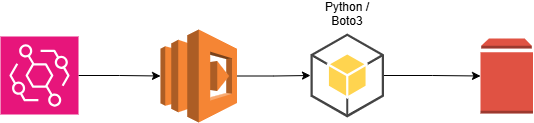

# Serverless FinOps Automation 💰⚡

## Project Overview

Unused cloud resources can continue generating costs after the workloads that originally used them are removed. One example is an Amazon EBS volume that remains in an `available` state after being detached from an EC2 instance.

This project demonstrates a serverless AWS FinOps workflow that identifies unattached EBS volumes and reports them for review. The Python script also includes an optional deletion API call that is intentionally disabled by default as a safety control.

## The Architecture

## The Solution

I built a lightweight Python automation using the AWS SDK for Python (`boto3`) that can run as an AWS Lambda function.

1. **The Trigger:** Amazon EventBridge can invoke the Lambda function on a scheduled basis.
2. **The Compute:** AWS Lambda runs the Python automation without requiring a continuously running server.
3. **The Scan:** The script uses the EC2 API to identify EBS volumes in the configured AWS Region with an `available` status.
4. **The Output:** Identified volume IDs are written to the Lambda logs for review.
5. **Safety Control:** The `delete_volume()` API call is included in the code but intentionally commented out. This prevents the portfolio version from automatically deleting storage without additional validation.

## Why the Safety Control Matters

An unattached EBS volume is not necessarily an abandoned volume. It may contain data that was intentionally preserved or may be needed later.

A production version of this automation should include additional safeguards before deletion, such as resource tags, volume age, snapshots, allow/deny lists, approval workflows, or other organizational retention policies.

## Core Technologies

- **Cloud Provider:** AWS
- **Compute:** AWS Lambda
- **Scheduling:** Amazon EventBridge
- **Language:** Python
- **AWS SDK:** Boto3
- **Storage Resource:** Amazon EBS

## Simulated Use Case: Unattached EBS Volume Cost Optimization

**Situation:** A cloud environment has accumulated detached EBS volumes after temporary EC2 workloads were removed. These volumes may continue generating storage charges.

**Task:** Create a serverless process that can periodically identify unattached EBS volumes so they can be reviewed for potential cost optimization.

**Action:** The Python script queries Amazon EBS using Boto3 and identifies volumes whose state is `available`. Each identified volume is logged. An optional `delete_volume()` operation is included but disabled by default to prevent unintended data loss.

**Result:** The project demonstrates how AWS Lambda, EventBridge, and Boto3 can be combined to automate identification of potentially unnecessary storage resources while retaining a safety control around destructive actions.

## Potential Improvements

Future enhancements could include:

- Scan multiple AWS Regions
- Estimate potential monthly savings
- Check volume age before flagging resources
- Require specific tags before deletion
- Create EBS snapshots before remediation
- Send SNS notifications for review
- Implement an approval workflow before deletion
- Add automated tests and structured logging
